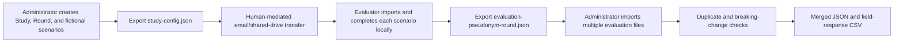

# Methodology and data flow

DPF-RT supports Phase 0 content/usability validation of the six-field Delivered Protection Framework. It is a data-collection and descriptive-agreement tool, not a risk calculator.

All persistence is browser-local. The application never transmits evaluation data. The approved Phase 0 pilot distribution channel is out-of-band file exchange for a 3–6-person panel.

Each evaluator rates every scenario. Narrative answers are reviewed qualitatively and never supplied to agreement functions. Cohen's κ, Fleiss' κ, and percent agreement use the seven ordinal rating variables per field; responses marked `insufficientInformation` are excluded rather than treated as a category.

Agreement values are descriptive and carry Landis–Koch labels only. The application does not apply the manuscript's κ ≥ 0.60 research threshold and never accepts/rejects a field or framework.

RTLX uses six unweighted 0–100 subscales. SUS is stored per scenario with a visible warning that this is a non-standard use measuring the experience of applying the framework to that task.

Breaking response-type and scale changes separate affected field data during merge. Wording-only changes are non-breaking. Different session IDs for the same evaluator/round/scenario remain separate and require a human decision.
